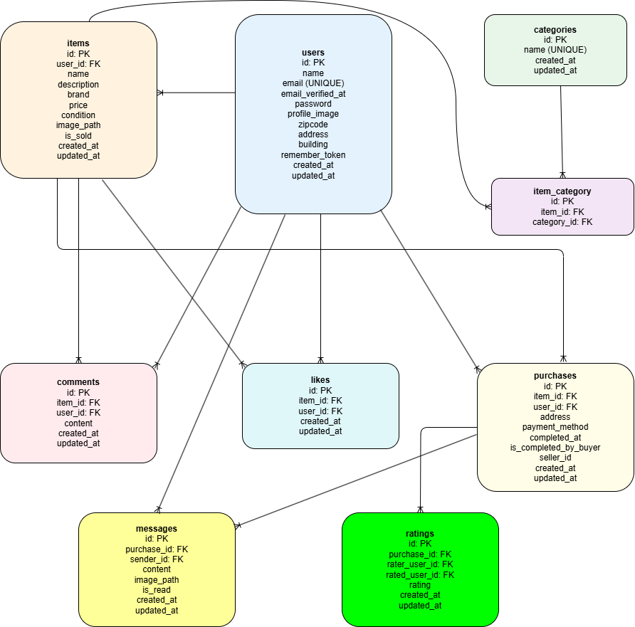

# coachtechフリマ

## 環境構築

### Dockerビルド
1. `git clone git@github.com:sakaisan1125/coachtech-fleamarket-app.git`
2. `cd coachtech-fleamarket-app`
3. `docker-compose up -d --build`

※MySQLはOSや環境によって起動しない場合があるので、必要に応じて `docker-compose.yml` を調整してください。

### Laravel環境構築
1. `docker-compose exec php bash`
2. `composer install`
3. `.env.example` をコピーして `.env` を作成し、環境に合わせて編集  
   例：
   ```env
   DB_HOST=mysql
   DB_PORT=3306
   DB_DATABASE=laravel_db
   DB_USERNAME=laravel_user
   DB_PASSWORD=laravel_pass

   MAIL_HOST=mailhog
   MAIL_PORT=1025
   MAIL_FROM_ADDRESS=noreply@coachtech.com
   MAIL_FROM_NAME="COACHTECH"
   APP_URL=http://localhost

   STRIPE_KEY=your_stripe_key_here
   STRIPE_SECRET=your_stripe_secret_here
   ```
   ※STRIPE_KEYとSTRIPE_SECRETはStripeのダッシュボードから取得してください。
4. アプリケーションキー生成  
   ```bash
   php artisan key:generate
   ```

5. マイグレーション＆シーディング  
   ```bash
   php artisan migrate --seed
   ```
6. 画像アップロード用ストレージリンク作成  
   ```bash
   php artisan storage:link
   ```

---

## 使用技術
- PHP 8.x
- Laravel 8.x
- MySQL 8.0.26
- Nginx / Docker / docker-compose
- phpMyAdmin / MailHog
- Stripe（決済機能）

---

## URL
- アプリ: [http://localhost](http://localhost)
- phpMyAdmin: [http://localhost:8080](http://localhost:8080)  
  ユーザー: `laravel_user` / パスワード: `laravel_pass`
- MailHog(WebUI): [http://localhost:8025](http://localhost:8025)

---

## アプリ概要
本アプリ「coachtechフリマ」は、COACHTECHの学習課題として開発した模擬案件のフリマアプリです。  
アイテムの出品と購入を安全・簡単に行えることを目的としています。  
制作目標として、初年度にユーザー数1000人達成を掲げ、  
10〜30代の社会人をターゲットユーザーに設定しています。 
プロフィール管理やコメント・いいね機能、カテゴリー検索など、  
既存サービスを参考にした便利な機能を搭載しています。

---

## 機能一覧
### ユーザー関連
- 新規登録（メール認証）
- ログイン / ログアウト
- プロフィール編集（名前・住所・画像）
- マイページ表示（出品履歴・購入履歴）

### 商品関連
- 商品一覧表示
- 商品検索（商品名部分一致検索）
- 商品詳細表示
- 出品（商品名・説明・価格・画像・カテゴリー・状態）
- 売却済みラベル表示

### 購入関連
- 購入画面表示
- 配送先住所の確認 / 変更
- 購入確定
- コンビニ決済対応  
  ※Stripeウェブフック未対応のため、コンビニ支払い後は手動で購入完了処理（下記参照）が必要です。

### コメント・いいね
- 商品へのコメント投稿 / 表示
- いいね追加 / 解除
- マイリスト表示（いいね一覧）

---

## 画面構成
- `/`：商品一覧
- `/?tab=mylist`：マイリスト（いいね一覧）ログイン時のみ中身を表示
- `/login`：ログイン
- `/register`：ユーザー登録
- `/sell`：商品出品
- `/item/{id}`：商品詳細
- `/purchase/{item}`：購入画面
- `/address/edit`：配送先変更画面
- `/mypage`：マイページ（出品商品一覧）
- `/mypage/profile`：プロフィール編集
- `/mypage?page=buy`：購入商品一覧タブ
- `/email/verify`：メール認証誘導画面

---

## テストユーザー
- メールアドレス：`test@example.com`
- パスワード：`password`

---

## 購入方法
### カード決済の購入完了方法

テスト環境では以下の情報を使用してください：
- カード番号：4242 4242 4242 4242
- 有効期限：未来日（例: 12/34）
- CVC：任意3桁（例: 123）
- 名義：任意（例: TEST USER）

3Dセキュア画面が表示された場合は、テスト環境の案内に従って「認証成功」を選択してください。
成功すると、アプリで設定している success_url にリダイレクトされます。
本アプリでは 成功遷移時点で購入確定処理を実行する設計 です（ウェブフックなし）。
万一、成功後に未反映の場合は下記の「コンビニ支払いの購入完了方法」と同様に session_id を用いた確認エンドポイントで確定処理を行えます。

### コンビニ決済の購入完了方法

本アプリはStripeのウェブフック未対応のため、  
コンビニ支払い後は「支払い済みを確認」ボタン（`/purchase/konbini/confirm?session_id=xxxx`）にアクセスして購入完了処理を行ってください。

### session_idの確認方法

- Stripe決済画面や支払い番号発行後の画面のURL（アドレスバー）に  
  `session_id=cs_test_xxxx...` というパラメータが含まれています。  
- この値をコピーして `/purchase/konbini/confirm?session_id=xxxx` にアクセスしてください。

※この操作で購入が確定し、商品が売却済みになります。

---

## メール認証について
新規登録後、メール認証が必要です。  
MailHog（[http://localhost:8025](http://localhost:8025)）で認証メールを受信できます。

---

## ER図

